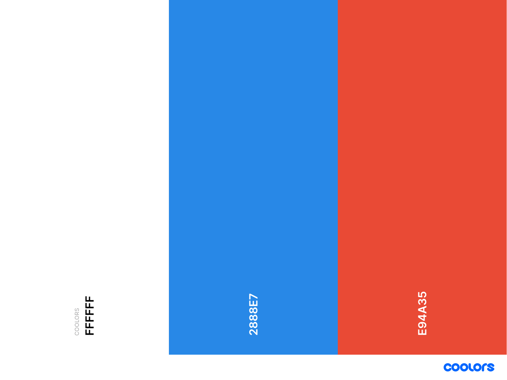

# StartUpHub

StartUpHub is a made up company that deals with website developing for new companies. We provide services that can be of great benefit when creating your own company. Our main focus is on creating very attractive websites for the young and modern population, as we mainly implement new ways and styles of web developing. Moreover, the other service we offer are consultations. We work closely with our clients to make sure we deliver exactely what they need. Our consultants will guide the clients by showcasing web desing elements and making them simple to understand in order to create a perfect working flow, and build a lasting relationship even after their website has been finished.


The image above is a screenshot from [Am I Responsive](http://ami.responsivedesign.is/#)

A demo of the website can be found here [www.Start-Up-Hub.com](https://sami-sinnari.github.io/MilestoneProject1/)

---

## Contents

- [**User Experience (UX)**](<#user-experience-(ux)>)

  - Project Goals
  - User Goals
  - Design
  - Wireframes

- [**Features**](#features)

  - The features implemented on this project
  - The features I would like to add in future

- [**Technologies**](#technologies-used)

  - Languages Used
  - Frameworks, Libraries and Programs Used

- [**Testing**](#testing)

- [**Deployment**](#deployment)

- [**Credits**](#credits)

---

## User Experience (UX)

### Project Goals

The main purpose of this project is to create a website that will support a newly created company. We would build the website for them and they would be provided with various designs. The website will show that we, as a company, have experience in creating new styles of websites that are attractive at first glance. I wanted to implement new way of website content wording,
as we have entered a new age of development. There is big competition on the market, which only brings needs to stand out.


### User Goals 

- As a **user**, I want to understand the purpose of the web site im visiting on first encounter.

- As a **user**, I want to be guided easly throught-out the website.

- As a **user**, I want to read about company's actions and the way they are dealing with Start-Ups.

- As a **user**, I want to read some testemonials to be sure this is the right company for me.

- As a **user**, I want to be able to contact the company and book a metting or get more information about their services and fees.


### Site Owner Goals :

- As a **site owner**, I want to be able to represent our company on the home page.

- As a **site owner**,  I want to attract the clients with special design as we are representing Web-develpment.

- As a **site owner**, I want to include navigation bar on every page so the user can navigate easily.

- As a **site owner**, I want to represent our services on a seperate page and add a button to a home page which will lead there.

- As a **site owner**, I want to showcast some of our reviews on the end of the page.

- As a **site owner**, I want include social media links as a footer on every page.

### Design

I wanted to implement a minimalistic approach to my design in order to make navigation thru the website simple and efficient. I have used color contrasts of white and blue with red/orange tones to match the background image. I decided to implement hover effects to show the flexibility of the company and the ablity of customizing the site thru advanced web-development. 

The site was created by Destkop first design because of two reasons :
 1. I decided to implement Desktop first design as I realized this will give me more coding knowledge, as I had to write more codes then I would with Mobile First design.
 2. The company is more focused on Desktop user's as we are buidling websites for other companies and usually the firms like ours are searched thru desktop PC. Nevertheless, I have adjusted desktop, tablet and mobile view therefore the site is fully responsive on any device.

#### Colors

Below are the combination of colors I decided to use on my website. I only changed the shades when implementing them on hover effects. I decided to use them as they are good match with the background image I used.



#### Typography

I decided to use two fonts from [Google Fonts](https://fonts.google.com/) throughout the website. Thrid font was used only in services section for a heading. I used 'Poppin' and 'Chilanka' as general font, and 'Rock and Salt' for services header. I decided to go with that font style as I believe they express the style I wanted to highlight for this type of website.

### Wireframes

Wireframes for my website were created using [Balsamiq](https://balsamiq.com/). 
I created wireframes for mobile, tablet and desktop view. 
Below are links to my wireframe pages.

#### Desktop view
[Home page](https://github.com/sami-sinnari/MilestoneProject1/blob/master/assets/wireframes/StartUpHub-Desktop-home.pdf) | [About page](https://github.com/sami-sinnari/MilestoneProject1/blob/master/assets/wireframes/StartUpHub-Desktop-about.pdf) |
 [Testimonials page](https://github.com/sami-sinnari/MilestoneProject1/blob/master/assets/wireframes/StartUpHub-Desktop-testimonials.pdf) | [Services page](https://github.com/sami-sinnari/MilestoneProject1/blob/master/assets/wireframes/StartUpHub-Desktop-services.pdf) | [Contact Modal](https://github.com/sami-sinnari/MilestoneProject1/blob/master/assets/wireframes/StartUpHub-Desktop-contact.pdf)
#### Tablet view
[Home page](https://github.com/sami-sinnari/MilestoneProject1/blob/master/assets/wireframes/StartUpHub-Tablet-home.pdf) |
 [About page](https://github.com/sami-sinnari/MilestoneProject1/blob/master/assets/wireframes/StartUpHub-Tablet-about.pdf) | 
[Testimonials page](https://github.com/sami-sinnari/MilestoneProject1/blob/master/assets/wireframes/StartUpHub-Tablet-testimonials.pdf) | [Services page](https://github.com/sami-sinnari/MilestoneProject1/blob/master/assets/wireframes/StartUpHub-Tablet-services.pdf) | [Contact Modal](https://github.com/sami-sinnari/MilestoneProject1/blob/master/assets/wireframes/StartUpHub-Tablet-contact.pdf)       
#### Mobile view
[Home page](https://github.com/sami-sinnari/MilestoneProject1/blob/master/assets/wireframes/StartUpHub-Phone-home.pdf) | [About page](https://github.com/sami-sinnari/MilestoneProject1/blob/master/assets/wireframes/StartUpHub-Phone-about.pdf) |
 [Testimonials page](https://github.com/sami-sinnari/MilestoneProject1/blob/master/assets/wireframes/StartUpHub-Phone-testimonials.pdf) | [Services page](https://github.com/sami-sinnari/MilestoneProject1/blob/master/assets/wireframes/StartUpHub-Phone-services.pdf) | [Contact Modal](https://github.com/sami-sinnari/MilestoneProject1/blob/master/assets/wireframes/StartUpHub-Phone-contact.pdf)

 Extra features added :

 - Contact Modal : I have changed the close button in modal to word : "nevermind" , which was added in right top corner and bottom.

 - Services page : I have added a paragraph at the bottom of the page explaning that our service fees are provided on inquiry.

#### [Contents](#contents)

---

## Features

### The features implemented on this project : 

- Navigation : I included navigation bar on every page so the user can navigate easly and it links are styled simple and modern, with hover effects. The navigation bar was created using [Bootstrap](https://getbootstrap.com/) .

- Background : I have added background image on all sizes with maching banner text and background image. The aim was to prove that visual user experience matters. Moreover, the font style of the website is lowercase because I am trying to show that something out of the ordinary can be attractive. By doing that, I have changed the usual word "Close" to "nevermind" as well.

- Contact form : I decided to change the typing style from "Contact us" to "say something" because I am trying to attract user's attention to details, thus leave a good impression of company's web design. A simple [Bootstrap](https://getbootstrap.com/) modal was used in order to create a contact form pop-up. I have customized the buttons on modal and included hover effects which are not responsive on smaller devices, but this will be implemented in the future through media(hover) effects.

- Testimonial section : The word "Testimonials" was changed with "our clients love our work" to focus the user on positivity before reading and seeing our ratings and comments.

- Social links : Links to social media were included as a footer on every page. I have added hover effects to footer and matched the colors with point of view.

### The features added then removed :
 - I have added different web design on my page, but decided to removed it as the change was too big. I managed to change the background image, text and color of the website when switching to smaller devices. For changing the header text, I used display none, to hide the previous text and then pseudo elements to make a new content. The old code of website can be found under "Commits".

### The features I would like to add in future :

- I would like to add :hover effects on tap, as :hover effect works only on destkop view. The :hover can be added in the future through @media(hover) element
- I would like to add few more services on the website thus expanding the business.
- I would like to implement back-end technology and make this website a real Start-Up company for Web design.
- I would like to add a company logo.

#### [Contents](#contents)

---

## Technologies Used

### Languages

- [HTML5](https://developer.mozilla.org/en-US/docs/Web/Guide/HTML/HTML5)
- [CSS](https://developer.mozilla.org/en-US/docs/Web/CSS)

### Frameworks, Libraries and Programs:

- [Bootstrap v4.5](https://getbootstrap.com/docs/4.5/getting-started/introduction/)
  - I implemented boostrap libarities in this projects as I felt it would be great learning oppurtinuty to use it. This provided me with understanding of Bootstrap and knowledge it has to offer. It was used aswell to give basic layout to the page and to also add other features including nav bar and modal.
- [Font Awesome](https://fontawesome.com/)
  - Font awesome was used to add icons to social media links.
- [Google Fonts](https://fonts.google.com/)
  - Google fonts were used to add 'Poppis', 'Chilanka' and 'Rock and Salt' fonts.
- [VSCode](https://code.visualstudio.com/)
  - VS Code was used to code the project alongside GitPod. 
- [Balsamiq](https://balsamiq.com/)
  - Balsamiq was used to create the wireframes for desktop, mobile and tablet view.
- [GitHub](https://github.com/)
  - GitHub was used to store the code that was pushed from VScode and to open a project in GitPod.
- [Gitpod](https://www.gitpod.io/)
  - Gitpod was used to code the project alongside VScode.

#### [Contents](#contents)

---

## Testing
For code testing I used W3C Markup Validator and W3C CSS Validator to check every page and code of the project.
The results are as follows:
- [W3C Markup Validator](https://validator.w3.org/)
  - services.html -  No errors or warnings to show.
  - index.html - no errors / 1 warning found  
    - The warning was a consideration to use h1 element only as a top-level heading,
      but in that case h1 element was used for that purpose.

- [W3C CSS Validator](https://jigsaw.w3.org/css-validator/#validate_by_input)
  - style.css - No error found.
    - The validator displayed 22 warnings. Six warnings were for -webkit/-moz/-o-background size's, and other sixteen warnings were in regards to background color being the same. The CSS validator didn't recognize the hover effects and the reason for the same background color.

### Testing User Stories from UX Section

As a **user**, I want to understand the purpose of the web site im visiting on the first encounter.

  - for a user, I've added a paragraph on the landing page explaining that we are building websites for Start-Up's.

As a **user**, I want to be guided easly throught-out the website.

  - for a user, I've added navigation bar to the top of every page on the website with links to each page an section.

As a **user**, I want to read about company's actions and the way they are dealing with Start-Ups.

  - for a user, I've explained the way to go in "about" section. Nevertheless, the "find out more
   button was added to landing page in order for user to get more information about our service.

As a **user**, I want to read some testemonials to be sure this is the right company for me.

  - for a user, I've added testimonials section at the end of the home page with ratings we received. By doing so, I'd like to attract user's attention to our success.

As a **user**, I want to be able to contact the company and book a metting or get more information about their services and fees.

  - for a user, I've added a Contact(Modal) link on every page where they can fill in their details. Once filled, we will contact them and provide them with service fees, as mentioned on the bottom of the page in services. Moreover, I have included social links to the footer on each page. These link to Instagram, LinkedIn, Facebook and Mail. All of those link will open in a seperate page so the user can easily come back to the site.

### Further Testing

I have also tested this site across multiple devices and browsers :

- Next to Google DevTool, I have used Firefox and Safari before submitting the code to GitHub.
- The site was tested on few personal devices like : Samsung Galaxy Note10 Plus, Saumsung Galaxy S9 Plus, iPhone X, iPhone SE, iPad, etc.
- The site has been reviewed by my Mentor Can Sücüllü and some students from my group jun-2020

#### [Contents](#contents)

 ---

## Deployment

### GitHub Pages

The project was deployed to GitHub Pages using the following steps:
 1. After pushing the project to GitHub, I opened the GitHub site and logged in.
 2. After logging in, I located the repository for the project: [github.com/sami-sinnari/MilestoneProject1](https://github.com/sami-sinnari/MilestoneProject1)
 3. At the top of the repository, I clicked on the "Settings" button.
 4. On the settings page, I scrolled down to the "GitHub Pages" section.
 5. Under "Source", I selected "Master Branch" from the dropdown menu.
 6. After the page refreshed itself, I scrolled back down to the "GitHub Pages" section to retrive the link to the published  site.

The site can be viewed here: https://sami-sinnari.github.io/MilestoneProject1/

### Making a Local Clone

To clone the repository to make a local copy on your computer, follow these steps:

1. Open GitHub and locate the GitHub repository: [github.com/sami-sinnari/MilestoneProject1](https://github.com/sami-sinnari/MilestoneProject1)
2. Under the repository name, click "Code" or "Clone" and copy the link to clone the repository using "HTTPS".
3. After copying the link, open terminal on your computer. This step can also be done in the terminal on an IDE.
4. Change the current working directory to the location where you want the cloned directory to be saved.
5. Type git clone, and then paste the URL: [https://github.com/sami-sinnari/MilestoneProject1](https://github.com/sami-sinnari/MilestoneProject1) - see example below:

```
git clone https://github.com/sami-sinnari/MilestoneProject1.git
```

7. Press Enter to create a local clone.

#### [Contents](#contents)

---

## Credits

### Pictures

Favicon :
  - Icon made by Icongeek26 from www.flaticon.com

Home page :
  - Background photo // Purchased on istockphoto.com

About page :
  - Icon arrow pointing down // made by Pixel perfect from www.flaticon.com
  - Numbers 1 to 3 in About section // Icons made by Freepik from www.flaticon.com

Testimonials section :
  - Testimonial picture 1 // Photo created by pch.vector at www.freepik.com
  - Testimonial picture 2 // Photo created by freepik at www.freepik.com
  -  Testimonial picture 3 // Photo by Pixabay from Pexels

Services page :
  - Icon made by Linector from www.flaticon.com // Icon in services page under "consultations"
  - Icon made by itim2101 from www.flaticon.com // Icon in services page under "content development"
  - Icon made by iconixar from www.flaticon.com // Icon in services page under "web design"

Contact us (modal) :
  - Icons made by Freepik from www.flaticon.com // Icon above "send" in contact form ("say something" modal)

### Code

The channels below were used to gain examples of how the page sections should look for business sites.

Testemonials section 
  - Look was inspired by [DarkCode's designs](https://www.youtube.com/channel/UCD3KVjbb7aq2OiOffuungzw)

Services page
  - Look was inspired by [Going-To Internet's](https://www.youtube.com/channel/UCfNzft_txAamoQvwh1j2HEQ ) way of styling the boxes. 

### Content
 - The content on this site was written by the developer.
 - The README.md is based on the Code Institute sample of README.md


### Acknowledgements

I would like to thank the people who have helped me through this project:

 - My mentor Can Sücüllü for his time, patience, and support during the Project and for all feedback and advice on this project.
 - My fellow students at Code Instutite and wonderful Slack community for all the support and feedback and Neringa Bickmore for sharing examples of her README file - alongside Code Institue's README.md file.
 - And lastly, i'd like to thank Code Institute's Staff for incredible content which provided me with sufficient knowledge to make this site myself.

#### [Contents](#contents)

---

This site was built for educational purposes. If you find any content not mentioned in **Credits** that violates the copyrights, please contact me on samisinnari@gmail.com

---