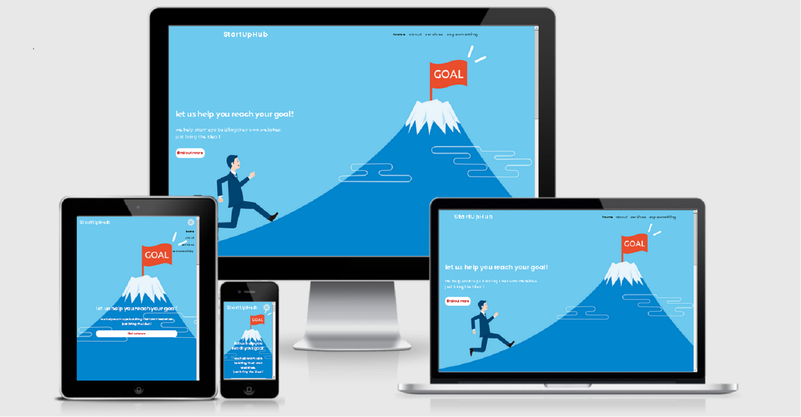

# StartUpHub

StartUpHub is a made up company that deals with website developing for new companies. We provide services that can be of great benefit when creating your own company. Our main focus is on creating very attractive websites for the young and modern population, as we mainly implement new ways and styles of web developing. Moreover, the other service we offer are consultations. We work closely with our clients to make sure we deliver exactely what they need. Our consultants will guide the clients by showcasing web desing elements and making them simple to understand in order to create a perfect working flow, and build a lasting relationship even after their website has been finished.

The image above is a screenshot from [Am I Responsive](http://ami.responsivedesign.is/#)

---

## User Experience (UX)

### Project Goals

The main purpose of this project is to create a website that will support a newly created company. We would build the website for them and they would be provided with various designs. The website will show that we, as a company, have experience in creating new styles of websites that are attractive at first glance. I wanted to implement new looks of website styles,
as we have entered a new age of development. There is big competition on the market, which only brings needs to stand out.

### User Goals 

- As a **user**, I want to understand the purpose of the web site im visiting on first encounter.

- As a **user**, I want to be guided easly throught-out the website.

- As a **user**, I want to read about company's actions and the way they are dealing with Start-Ups.

- As a **user**, I want to read some testemonials to be sure this is the right company for me.

- As a **user**, I want to be able to contact the company and book a metting or get more information about their services and fees.

### Site Owner Goals :

- As a **site owner**, I want to be able to represent our company on the home page.

- As a **site owner**,  I want to attract the clients with special design as we are representing Web-develpment.

- As a **site owner**, I want to include navigation bar on every page so the user can navigate easly.

- As a **site owner**, I want to represent our services on a seperate page and add a button on a home page which will lead there.

- As a **site owner**, I want to showcast some of our reviews on the end of the page.

- As a **site owner**, I want include social media links as a footer on every page.

### Design

I wanted to implement a minimalistic approach to my design in order to make navigation thru the website simple and efficient. I decided to design the website differently in destkop and tablet/mobile view. In destkop view, I have used color contrasts of blue with red tones, wheres in tablet/mobile view I used the same contrast in reverse. By doing so, I aimed to create a better visual dynamic in order to showcase the power of design.

### Wireframes

Wireframes for my website were created using [Balsamiq](https://balsamiq.com/). I created wireframes for mobile, tablet and desktop view. Below are links to my wireframes.

#### Desktop view
| [Home page](https://github.com/sami-sinnari/MilestoneProject1/blob/master/assets/wireframes/StartUpHub-Desktop-home.pdf)|
| [About page](https://github.com/sami-sinnari/MilestoneProject1/blob/master/assets/wireframes/StartUpHub-Desktop-about.pdf)|
| [Testimonials page](https://github.com/sami-sinnari/MilestoneProject1/blob/master/assets/wireframes/StartUpHub-Desktop-testimonials.pdf)|
| [Services page](https://github.com/sami-sinnari/MilestoneProject1/blob/master/assets/wireframes/StartUpHub-Desktop-services.pdf)|
| [Contact Modal](https://github.com/sami-sinnari/MilestoneProject1/blob/master/assets/wireframes/StartUpHub-Desktop-contact.pdf)|
#### Tablet view
| [Home page](https://github.com/sami-sinnari/MilestoneProject1/blob/master/assets/wireframes/StartUpHub-Tablet-home.pdf)|
| [About page](https://github.com/sami-sinnari/MilestoneProject1/blob/master/assets/wireframes/StartUpHub-Tablet-about.pdf)|
| [Testimonials page](https://github.com/sami-sinnari/MilestoneProject1/blob/master/assets/wireframes/StartUpHub-Tablet-testimonials.pdf)|
| [Services page](https://github.com/sami-sinnari/MilestoneProject1/blob/master/assets/wireframes/StartUpHub-Tablet-services.pdf)|
| [Contact Modal](https://github.com/sami-sinnari/MilestoneProject1/blob/master/assets/wireframes/StartUpHub-Tablet-contact.pdf)|         
#### Mobile view
| [Home page](https://github.com/sami-sinnari/MilestoneProject1/blob/master/assets/wireframes/StartUpHub-Phone-home.pdf)|
| [About page](https://github.com/sami-sinnari/MilestoneProject1/blob/master/assets/wireframes/StartUpHub-Phone-about.pdf)|
| [Testimonials page](https://github.com/sami-sinnari/MilestoneProject1/blob/master/assets/wireframes/StartUpHub-Phone-testimonials.pdf)|
| [Services page](https://github.com/sami-sinnari/MilestoneProject1/blob/master/assets/wireframes/StartUpHub-Phone-services.pdf)|
| [Contact Modal](https://github.com/sami-sinnari/MilestoneProject1/blob/master/assets/wireframes/StartUpHub-Phone-contact.pdf)|

## Features

### The features implemented on this project: 

- Navigation: I included navigation bar on every page so the user can navigate easly and it links are styled simple and modern, with hover effects. The navigation bar was created using [Bootstrap](https://getbootstrap.com/) .

- Background: I have added background images on all sizes with maching banner text and background pictures. The aim was to prove that visual user experience matters. I decided to seperate destkop and tablet/mobile view of the website as we are web development company, and this shows our flexibility with designs. Moreover, the font style of the website is lowercase because I am trying to show that something out of the ordinary can be attractive.

- Contact form: I decided to change the typing style from "Contact us" to "say something" because I am trying to attract user's attention to details, thus leave a good impression of company's web design. A simple [Bootstrap](https://getbootstrap.com/) modal was used in order to create a contact form pop-up. I have customized the buttons on modal and included hover effects.

- Testimonial section: The word "Testimonials" was changed with "our clients love our work" to focus the user on positivity before reading and seeing our ratings and comments.

- Social links: Links to social media were included as a footer on every page. I have added hover effects to footer and matched the colors with point of view.

### The features I would like to add in future :

- I would like to add :hover effects on tap, as :hover effect works only on destkop view. The :hover can be added in the future through @media(hover) element
- I would like to add few more services on the website thus expand the business.
- I would like to add different design style only for @media (max-width:400)
- I would like to implement back-end technology and make this website a real Start-Up company for Web design.
- I would like to add a company logo.

## Technologies Used

### Languages

- [HTML5](https://developer.mozilla.org/en-US/docs/Web/Guide/HTML/HTML5)
- [CSS](https://developer.mozilla.org/en-US/docs/Web/CSS)

### Frameworks, Libraries and Programs:

[Bootstrap v4.5](https://getbootstrap.com/docs/4.5/getting-started/introduction/)
I implemented boostrap libarities in this projects as I felt it would be great learning oppurtinuty to use it. This provided me with understanding of Bootstrap and knowledge it has
to offer. It was used aswell to give basic layout to the page and to also add other features including nav bar and modal.

[Font Awesome](https://fontawesome.com/)
I have used font awsome to add icons to social media links.

[Google Fonts](https://fonts.google.com/)
I have used Google fonts to add Poppis and Raleway font.

[VSCode](https://code.visualstudio.com/)
I have used VS Code to code the project. 

[Balsamiq](https://balsamiq.com/)
I have used Balsamiq to create the wireframes for desktop, mobile and tablet view.

### Testing

-----

### Deployment

For deployment, I have used VS Code with few extensions. Before submitting, I have used Google Chrome Developer Tool.

Extensions I used in VS code were : 

- Bootstrap 4, Font awesome 4, Font Awesome 5 Free & Pro snippets
- Live Server
- vscode-pdf

-----

### Credits

Background photo // Purchased on istockphoto.com

Icons made by itim2101 www.flaticon.com // Photo in services ( content development)

Icon arrow pointing down made by Pixel perfect from www.flaticon.com //  Arrow pointing down in About section

Icons made by Freepik from www.flaticon.com // Number 1, 2 and 3 in About section.

Photo by Mohammad Sadiq Padela from Pexels // Testimonials photo 1

Photo by Andrea Piacquadio from Pexels // Testimonials photo 2

Photo by Pixabay from Pexels // Testimonials photo 3

Gold vector created by rawpixel.com // Background img max-width:900px